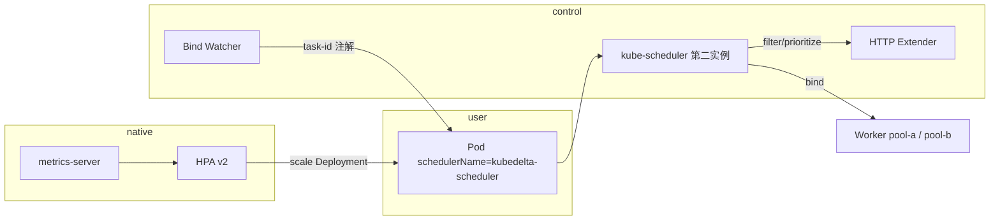

# kubedelta

在 **Ubuntu/Linux** 上通过 **kind + kubeadm** 搭建本地多节点 Kubernetes 测试集群，并运行独立的 **kube-scheduler**（`kubedelta-scheduler`）+ **Scheduler Extender**，实现业务侧的调度检查与留痕；横向扩容使用原生 **HPA + metrics-server**，节点池扩容用 kind 动态加 worker 模拟。

## 架构概览



| 能力 | 实现方式 |
|------|----------|
| 集群引导 | kind（底层 kubeadm） |
| 调度检查 | Extender `/filter`：集群容量、节点 Ready、nodepool 匹配 |
| 调度优选 | Extender `/prioritize`：带 toleration 时优先 `kubedelta.io/tolerance=true` 节点 |
| 调度留痕 | Extender Bind Watcher：绑定后写入 `kubedelta.io/task-id` |
| 容器横向扩容 | 原生 HPA（CPU 70%） |
| 节点池扩容 | `scripts/simulate-lamby-scale.sh` 追加 kind worker |

## Ubuntu 前置条件

```bash
# Docker 引擎（kind 依赖）
sudo apt-get update && sudo apt-get install -y docker.io
sudo usermod -aG docker "$USER"   # 重新登录后无需 sudo docker
newgrp docker                     # 或当前终端临时生效

# Go 1.23+（构建 extender）
# kind / kubectl 可由 make tools 安装到项目 .bin/
```

确认：`docker info` 与 `go version` 正常。

## 一键启动

```bash
cd kubedelta
export PATH="$(pwd)/.bin:$PATH"

make tools      # kind + kubectl（若缺失）
make cluster-up # 创建集群、加载镜像、部署调度器与演示负载
make verify     # 检查节点标签、调度结果、HPA
```

成功后 kubeconfig 上下文为 `kind-kubedelta`。

## 常用操作

```bash
# 查看调度留痕
kubectl -n kubedelta-system get pods \
  -o custom-columns=NAME:.metadata.name,NODE:.spec.nodeName,TASK:.metadata.annotations.kubedelta\\.io/task-id

# 模拟 lamby 扩容：新增 worker 节点池 pool-c
make scale-node POOL=pool-c

# 给 demo-app 加压触发 HPA（需 metrics 就绪）
kubectl -n kubedelta-system run load --image=busybox:1.36 --restart=Never -- \
  sh -c "while true; do wget -q -O- http://demo-app; done"

# 销毁集群
make cluster-down
```

## 个性化扩展点

- **nodepool**：Pod 注解 `kubedelta.io/nodepool` ↔ 节点标签 `nodepool.kubedelta.io/name`
- **调度策略**：编辑 `deploy/20-scheduler.yaml` 中 ConfigMap 的 `KubeSchedulerConfiguration`（plugins / extenders）
- **检查逻辑**：修改 `pkg/extender/server.go` 中 `clusterCapacityCheck` / `perNodeFilter`
- **OMS 策略**：`deploy/30-mock-oms.yaml` 用 ConfigMap 模拟，可替换为真实 OMS API

## 目录说明

| 路径 | 说明 |
|------|------|
| `cluster/kind-config.yaml` | 1 control-plane + 2 worker（pool-a / pool-b） |
| `deploy/20-scheduler.yaml` | 第二 kube-scheduler + extender |
| `deploy/50-hpa.yaml` | demo-app 原生 HPA |
| `pkg/extender/` | HTTP Extender 与 Bind Watcher |
